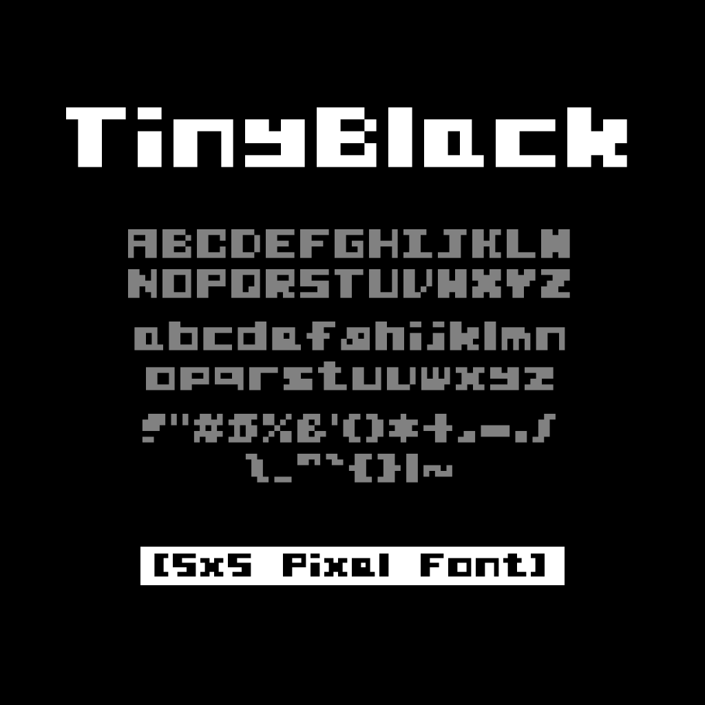

# Tiny Black - 5x5 Pixel Font

TinyBlack is a small, bold pixel font composed of 5x5 characters. It includes 94 characters, including alphanumeric characters and symbols.

This font was made by [ase2ttf](https://ase2ttf.com/).

## License

[SIL Open Font License](LICENSE)
